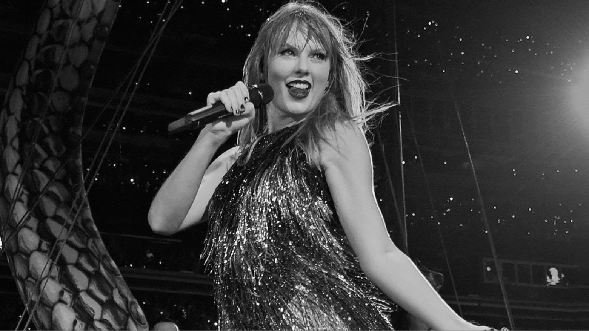

# ObjectDetection
The code identifies the major object in the image or video and makes everything except fot the major object black and white.

Refer to change_image.ipynb for images and change_video.ipynb for the videos.

## Screenshots
#### Input

#### Full black and white image

#### Output

